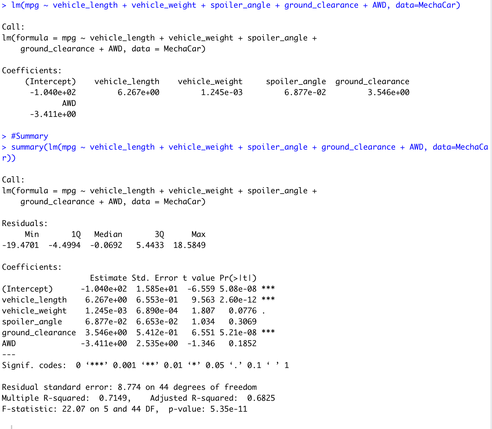
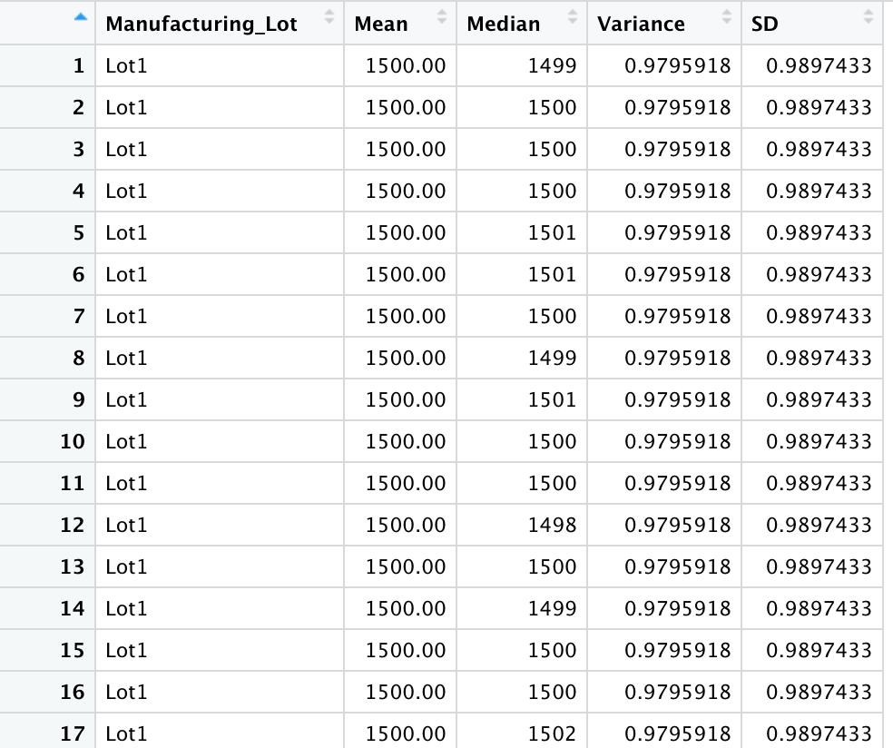
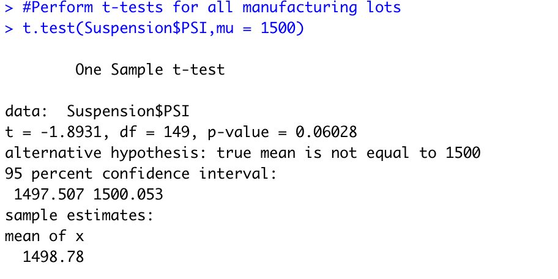
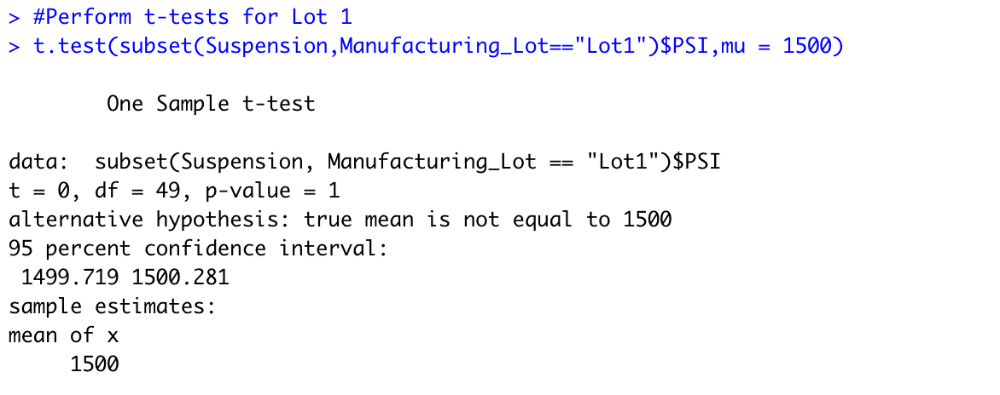
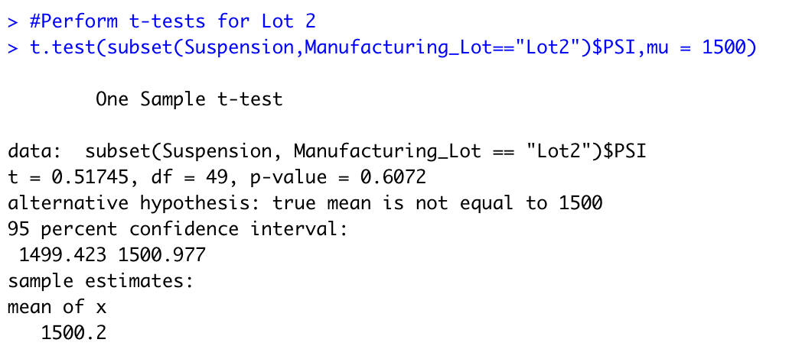
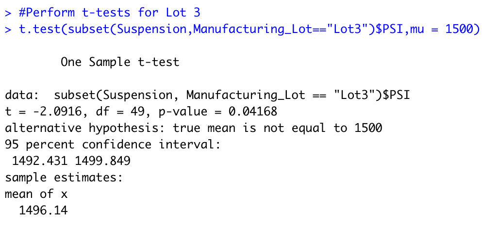

# MechaCar Statistical Analysis

## Overview

The MechaCar, AutosRUs' newest prototype, is experiencing production issues that are impeding the manufacturing team's progress. Upper management at AutosRUs has asked Jeremy and the data analytics team to review production data for insights that can help the manufacturing team.

In this challenge we will:

- Conduct multiple linear regression analysis to determine which variables in the dataset predict MechaCar prototype mpg.
- Compile summary data on the pounds per square inch (PSI) of suspension coils from manufacturing lots.
- Use t-tests to see if the manufacturing lots differ statistically from the average population.
- Create a statistical study to compare the performance of MechaCar vehicles to other manufacturers' vehicles.

## Linear Regression to Predict MPG

We designed a linear model that predicts the "mpg" of MechaCar prototypes using several variables and the resulting model can be viewed on the image below:

	

From the results above:

- Which variables/coefficients provided a non-random amount of variance to the mpg values in the dataset?

    In this dataset the "vehicle_length", "ground_clearance" (as well as the "intercept") provided non-random amounts of variance to the mpg values. 

- Is the slope of the linear model considered to be zero? Why or why not?

    The linear model's slope is not considered to be zero as the "p-Value" for this model is 5.35e-11 which is significantly smaller than the "significance level = 0.05%". 

- Does this linear model predict mpg of MechaCar prototypes effectively? Why or why not?

    This linear model predicts prototypes of mpg MechaCar effectively since the "r-squared" value is 0.7149, which means that about 71% of all mpg predictions will be effectively determined by this model.

## Summary Statistics on Suspension Coils

The `Suspension_Coil.csv` file contains data on the results of testing weight capacities of various suspension coils from several production lots to determine overall consistency.

- Total Summary

- Lot Summary

From the results above:

The design specifications for the MechaCar suspension coils dictate that the variance of the suspension coils must not exceed 100 pounds per square inch (PSI). Does the current manufacturing data meet this design specification for all manufacturing lots in total and each lot individually? Why or why not? 

For this model, "Lot 1" and "Lot 2" meet design specifications, having very close mean and median values, with variances of "0.97" and "7.47". However, "Lot 3" has the most variance amongst the three, "170.28" and does not meet the manufacturing expectations.

## T-Tests on Suspension Coils

T-tests were conducted on the `Suspension_Coil.csv` to determine if there is a statistical difference on this dataset. Using the sample population mean of 1500, these are our findings:

- T-test for all lots

	

We can observe from the results that the true mean is "1498.78" which was also on our summary statistics table for "Deliverable 2". The t-test shows there is not enough evidence to reject the null hypothesis since the "p-value" for all manufacturing lots is 0.06028 higher than the common significance level of 0.05. 

- T-tests for Lot 1

- T-tests for Lot 2

- T-tests for Lot 3

For each individual lot, Lot 1 had a p-value of 1 and Lot 2 had a p-value of 0.60, both statistically similar which means we cannot reject the null hypothesis. For "Lot 3", the sample mean is 1496.1 with a p-Value of 0.04, lower than the significance level of 0.05 which indicates that the sample mean and the presumed population mean are not statistically different.

## Study Design: MechaCar vs Competition

It would be interesting to conduct a study that collects data on MechaCar and comparable models from other manufacturers as a popular feature that consumers heavily consider when thinking of purchasing a car is fuel efficiency as it greatly impacts costs of ownership per year.

- What metric or metrics are you going to test?
    - Driving system (2-wheel, 4-wheel)
    - Fuel Capacity / Fuel type (Electric, Hybrid, Gasoline)
    - MPG (Gasoline Efficiency)
	

- What is the null hypothesis or alternative hypothesis?
    Is the MechaCar fuel efficiency performance adequately priced based on its performance or not.

- What statistical test would you use to test the hypothesis? And why?
    Conducting a multiple linear regression to determine the metrics that have the most significant correlation and predictability with the best fuel efficiency and its impact on the vehicle price.

- What data is needed to run the statistical test?
    - Exhaust system emissions data
    - Transmission efficiency data
